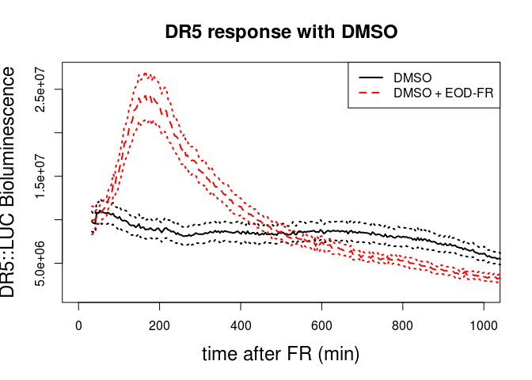

# Mueller-Moule_Analyses


### This Markdown file includes the code to produce the graphs for Mueller-Moule et al, 2016.


```r
library(ggplot2)
library(lmerTest)
library(reshape2)
library(arm)
library(scales)
library(affy)
library(limma)
```

# Figure 1

## Figure 1A


```r
get.excel2 <- function(filename)
  #function to convert a column based spreadsheet of measurements into a dataframe.
  #the first column should consist of grouping variable names, corresponding to the contents
  #of each row.  The first row of data should have a row name of "Data"
  {
     vars <- as.character(read.table(file=filename,sep=",",fill=TRUE,blank.lines.skip=FALSE)[,1])
     data.start <- match("Data", vars)
     data.table <- read.table(file=filename,sep=",",skip=data.start-1,fill=TRUE)[,-1]
     last <- ifelse(match("",vars)>data.start,data.start-1,match("",vars)-1) #where is the last grouping variable? 
     header <- read.table(file=filename, sep=",",fill=TRUE,as.is=TRUE)[1:last,-1]
     time.frame <- as.data.frame(data.table[,header[1,]=="time"] )#extract the time information
     colnames(time.frame) <- header[3,header[1,]=="time"]
     data.table <- data.table[,header[1,]!="time"] #remove time information from data table, leaving hyp info
     header <- header[,header[1,]!="time"] #remove time information from header
     data.na <- is.na(data.table)
     time.table <- time.frame[,match(header[3,],colnames(time.frame))] # expand time.frame so that there is one column per plant
     tmp.frame <- data.frame(line=col(data.na)[!data.na],
     						 time=time.table[!data.na],
     						 y=data.table[!data.na])

      for (i in (1:last))
       tmp.frame[,vars[i]] <- factor(unlist(header[i,])[tmp.frame$line])
     return(tmp.frame)
   }

data <- get.excel2("Fig1A_basic_22507-2.27.07_data.csv")

summary(data)
```

```
##       line           time            y                   name     
##  Min.   : 1.0   Min.   :  45   Min.   : 124057   Control 1 :  94  
##  1st Qu.:24.0   1st Qu.: 375   1st Qu.:1092891   Control 10:  94  
##  Median :47.5   Median : 735   Median :1712500   Control 11:  94  
##  Mean   :47.5   Mean   : 735   Mean   :2034821   Control 12:  94  
##  3rd Qu.:71.0   3rd Qu.:1095   3rd Qu.:2732010   Control 13:  94  
##  Max.   :94.0   Max.   :1425   Max.   :8206870   Control 14:  94  
##                                                  (Other)   :3854  
##    treatment      TL           plant           date           uniq     
##  Control:2115   TL1:4418   1      : 188   2.25.07:2256   1      :  47  
##  FR     :2303              10     : 188   2.27.07:2162   10     :  47  
##                            11     : 188                  11     :  47  
##                            12     : 188                  12     :  47  
##                            13     : 188                  13     :  47  
##                            14     : 188                  14     :  47  
##                            (Other):3290                  (Other):4136
```

```r
dr5.mean <- tapply(data$y,list(data$time,data$treatment),mean)

dr5.sem <- tapply(data$y,list(data$time,data$treatment),function(x) sd(x)/sqrt(length(x)))
```


Make plot


```r
op <- par(mar=par()$mar+.5)

op2 <- options(scipen=-1)

matplot(x=as.numeric(rownames(dr5.mean)),y=cbind(dr5.mean+dr5.sem,dr5.mean-dr5.sem),
		type="l",lwd=2,lty=3,col=c("black","red"),
		xlab="time after FR (min)",ylab="DR5:LUC Bioluminescence",
		main="DR5 response in seedlings",cex.lab=1.5,cex.main=1.5,xlim=c(0,1000),xaxp=c(0,1000,10),ylim=c(1000000,4000000))

matlines(x=as.numeric(rownames(dr5.mean)),y=dr5.mean,lwd=2,lty=1:2,col=c("black","red"))

legend("topright",legend=c("Control","EOD-FR"),lwd=2,lty=1:2,col=c("black","red"))
```

<!-- -->


## Figure 1 C and G

Get the data and calculate mean and sem


```r
fig1cg.data <- read.csv("FIG1CG_DR5_EOD-FR_3.14-3.16.07.csv")

fig1cg.data$plant <- factor(fig1cg.data$plant)

summary(fig1cg.data)
```

```
##      plant          signal              slice             time       
##  14     : 337   Min.   :1.319e+06   Min.   :  0.00   Min.   : -10.0  
##  15     : 337   1st Qu.:5.656e+06   1st Qu.: 82.25   1st Qu.: 365.0  
##  16     : 337   Median :1.089e+07   Median :165.00   Median : 693.0  
##  17     : 337   Mean   :1.636e+07   Mean   :164.91   Mean   : 693.2  
##  18     : 337   3rd Qu.:2.051e+07   3rd Qu.:247.00   3rd Qu.:1021.0  
##  19     : 337   Max.   :1.346e+08   Max.   :337.00   Max.   :1377.0  
##  (Other):9180                                                        
##       date        treatment   
##  3.14.07:4290   DMSO   :2960  
##  3.15.07:3370   DMSO+FR:1986  
##  3.16.07:3542   NPA    :2622  
##                 NPA+FR :3634  
##                               
##                               
## 
```

```r
fig1cg.data <- fig1cg.data[fig1cg.data$time>0,] #initial timepoint light contaminated

dr5.mean <- tapply(fig1cg.data$signal,list(fig1cg.data$time,fig1cg.data$treatment),mean)

dr5.individuals <- tapply(fig1cg.data$plant,list(fig1cg.data$treatment),function(x) nlevels(factor(x)))

dr5.sem <- tapply(fig1cg.data$signal,list(fig1cg.data$time,fig1cg.data$treatment),function(x) sd(x)/sqrt(length(x)))
```

### Plot figure 1C


```r
op <- par(mar=par()$mar+.5)

ylim=c(0,max(dr5.mean+dr5.sem))

matplot(x=as.numeric(rownames(dr5.mean)),y=cbind(dr5.mean+dr5.sem,dr5.mean-dr5.sem)[,c(3,4,7,8)],type="l",lwd=2,lty=3,col=c("black","red"),
		xlab="time after FR (min)",ylab="DR5::LUC Bioluminescence",main="DR5 response with NPA",cex.lab=1.5,cex.main=1.5,xlim=c(0,1000),xaxp=c(0,1000,5))#,ylim=ylim)

matlines(x=as.numeric(rownames(dr5.mean)),y=dr5.mean[,c(3,4)],lwd=2,lty=1:2,col=c("black","red"))

legend("topright",legend=c("NPA","NPA + EOD-FR"),lwd=2,lty=1:2,col=c("black","red"))
```

<!-- -->

### plot fig 1G


```r
matplot(x=as.numeric(rownames(dr5.mean)),y=cbind(dr5.mean+dr5.sem,dr5.mean-dr5.sem)[,c(1,2,5,6)],
	type="l",lwd=2,lty=3,col=c("black","red"),
	xlab="time after FR (min)",ylab="DR5::LUC Bioluminescence",main="DR5 response with DMSO",cex.lab=1.5,cex.main=1.5,xlim=c(0,1000),xaxp=c(0,1000,5))

matlines(x=as.numeric(rownames(dr5.mean)),y=dr5.mean[,c(1,2)],lwd=2,lty=1:2,col=c("black","red"))

legend("topright",legend=c("DMSO","DMSO + EOD-FR"),lwd=2,lty=1:2,col=c("black","red"))
```

<!-- -->

```r
par(op)
```

# Figure 2 YUCCA Expression

## Figure 2A

### Raw Data Processing

To perform this analysis starting with the rae data, download the cell files from [Array Express](https://www.ebi.ac.uk/arrayexpress/experiments/E-MEXP-443)


```r
data <- ReadAffy(celfile.path="SessaData/")  ## Change to wherever you put the cel files

pData(data)$treat <- rep(c("low_RFR_1h","low_RFR_4d","high_RFR"),2)

pData(data)
```

```
##                                             sample      treat
## At_seedling_WT1_1h_lowR-FR_ATH1_UR1_JDB.CEL      1 low_RFR_1h
## At_seedling_WT1_4d_lowR-FR_ATH1_UR1_JDB.CEL      2 low_RFR_4d
## At_seedling_WT1_ATH1_UR1_JDB.CEL                 3   high_RFR
## At_seedling_WT2_1h_lowR-FR_ATH1_UR1_JDB.CEL      4 low_RFR_1h
## At_seedling_WT2_4d_lowR-FR_ATH1_UR1_JDB.CEL      5 low_RFR_4d
## At_seedling_WT2_ATH1_UR1_JDB.CEL                 6   high_RFR
```

```r
data <- rma(data)
```

```
## Warning: replacing previous import 'AnnotationDbi::tail' by 'utils::tail'
## when loading 'ath1121501cdf'
```

```
## Warning: replacing previous import 'AnnotationDbi::head' by 'utils::head'
## when loading 'ath1121501cdf'
```

```
## 
```

```
## Background correcting
## Normalizing
## Calculating Expression
```

```r
##now add the annotation data

affyData <- read.csv("affy_ATH1_array_elements-2010-12-20_small.csv") #read TAIR annotation data from file

names(affyData) <- c("element","is.control","locus","description")#get rid of underlines

genes <- data.frame(element=featureNames(data)) #get affy gene names from dataset

affyMatch <- merge(affyData,genes,by.x="element",by.y=1)# reorder the annotation data to match chip data
```

### Use limma to model and extract gene expression values

```r
pData(data)$treat <- factor(pData(data)$treat)

design <- model.matrix(~-1+pData(data)$treat)

colnames(design) <- levels(pData(data)$treat)

fit <- lmFit(data,design)

yuccas<- c("AT4G32540","AT5G11320","AT4G13260","AT5G25620","AT1G48910","AT4G28720","AT1G04180","AT5G43890","AT2G33230","AT1G04610","AT1G21430")

yucca.names <- c("YUCCA1","YUCCA4","YUCCA2","YUCCA6","YUCCA10","YUCCA8","YUCCA9","YUCCA5","YUCCA7","YUCCA3","YUCCA11")

#for plotting, want an overall model, without the specific contrast
plot.fit <- eBayes(fit)
plot.fit$genes <- affyMatch$locus
plot.fit <- plot.fit[match(yuccas,plot.fit$genes),]
plot.fit$genes <- yucca.names

#get the order right
plot.fit <- plot.fit[match(paste("YUCCA",1:11,sep=""),plot.fit$genes),]
plot.fit$genes <- paste("YUCCA",1:11,sep="") #not sure why this is needed, but the above line converts to factor

#plot all three time points
par(mar=c(10, 5, 4, 2) + 0.1)
matplot(t(plot.fit$coef[,1:3]),type="b",pch=1:dim(plot.fit)[1],lty=1:dim(plot.fit)[1],xlim=c(1,3.5),xaxt="n",ylab="expression (log 2)",cex.axis=1.5,cex.lab=1.5,lwd=2,cex=2,col=1:dim(plot.fit)[1])
legend("topright",legend=plot.fit$genes,lty=1:dim(plot.fit)[1],pch=1:dim(plot.fit)[1],col=1:dim(plot.fit)[1],lwd=2)
axis(1,at=1:3,labels=colnames(plot.fit),las=3,cex.axis=1.5)
```

<!-- -->

## Figure 2 B and C

See file "Fig2BC_qPCR.xls"

# Figure 4

## Figure 4 A


```r
Fig4A.data <- read.csv("Fig4A_yuccaHyps031008_paper.csv",row.names=1)

head(Fig4A.data)
```

```
##    plant   hyp   gt  treat plate
## 89     1 5.373 yucQ EOD-FR     2
## 90     2 6.067 yucQ EOD-FR     2
## 91     3 6.597 yucQ EOD-FR     2
## 92     4 4.377 yucQ EOD-FR     2
## 93     5 4.608 yucQ EOD-FR     2
## 94     6 3.834 yucQ EOD-FR     2
```

```r
summary(Fig4A.data)
```

```
##      plant             hyp                 gt         treat    
##  Min.   : 1.000   Min.   : 2.370   Col      :65   Control:102  
##  1st Qu.: 3.000   1st Qu.: 3.623   yucQ     :67   EOD-FR :149  
##  Median : 6.000   Median : 4.904   yucT18-11:74                
##  Mean   : 6.235   Mean   : 5.030   yucT46-8 :45                
##  3rd Qu.: 9.000   3rd Qu.: 6.353                               
##  Max.   :15.000   Max.   :10.118                               
##      plate       
##  Min.   : 2.000  
##  1st Qu.: 3.000  
##  Median : 5.000  
##  Mean   : 5.677  
##  3rd Qu.: 9.000  
##  Max.   :10.000
```

```r
Fig4A.data$gt <- as.character(Fig4A.data$gt)

Fig4A.data$gt[Fig4A.data$gt=="yucQ"] <- "yucca35789"
Fig4A.data$gt[grep("yucT",Fig4A.data$gt)] <- "yucca589"

Fig4A.data$gt <- factor(Fig4A.data$gt)

summary(Fig4A.data)
```

```
##      plant             hyp                  gt          treat    
##  Min.   : 1.000   Min.   : 2.370   Col       : 65   Control:102  
##  1st Qu.: 3.000   1st Qu.: 3.623   yucca35789: 67   EOD-FR :149  
##  Median : 6.000   Median : 4.904   yucca589  :119                
##  Mean   : 6.235   Mean   : 5.030                                 
##  3rd Qu.: 9.000   3rd Qu.: 6.353                                 
##  Max.   :15.000   Max.   :10.118                                 
##      plate       
##  Min.   : 2.000  
##  1st Qu.: 3.000  
##  Median : 5.000  
##  Mean   : 5.677  
##  3rd Qu.: 9.000  
##  Max.   :10.000
```

```r
Fig4A.data$plate <- factor(Fig4A.data$plate)

table(Fig4A.data$gt,Fig4A.data$treat)
```

```
##             
##              Control EOD-FR
##   Col             24     41
##   yucca35789      29     38
##   yucca589        49     70
```

```r
lmer1 <- lmer(hyp ~ gt*treat + (1|plate),data=Fig4A.data)
summary(lmer1) #essentially no plate effect
```

```
## Linear mixed model fit by REML t-tests use Satterthwaite approximations
##   to degrees of freedom [lmerMod]
## Formula: hyp ~ gt * treat + (1 | plate)
##    Data: Fig4A.data
## 
## REML criterion at convergence: 668.4
## 
## Scaled residuals: 
##     Min      1Q  Median      3Q     Max 
## -2.8869 -0.5806 -0.0620  0.6264  3.5955 
## 
## Random effects:
##  Groups   Name        Variance Std.Dev.
##  plate    (Intercept) 0.0000   0.0000  
##  Residual             0.8189   0.9049  
## Number of obs: 251, groups:  plate, 6
## 
## Fixed effects:
##                          Estimate Std. Error       df t value Pr(>|t|)    
## (Intercept)                3.7574     0.1847 245.0000  20.341  < 2e-16 ***
## gtyucca35789              -0.3787     0.2497 245.0000  -1.516  0.13072    
## gtyucca589                -0.2573     0.2255 245.0000  -1.141  0.25494    
## treatEOD-FR                3.1070     0.2326 245.0000  13.359  < 2e-16 ***
## gtyucca35789:treatEOD-FR  -0.9836     0.3223 245.0000  -3.052  0.00253 ** 
## gtyucca589:treatEOD-FR    -0.7157     0.2872 245.0000  -2.492  0.01338 *  
## ---
## Signif. codes:  0 '***' 1e-03 '**' 0.01 '*' 0.05 '.' 0.1 ' ' 1
## 
## Correlation of Fixed Effects:
##             (Intr) gt35789 gty589 tEOD-F g35789:
## gtyucc35789 -0.740                              
## gtyucca589  -0.819  0.606                       
## treatEOD-FR -0.794  0.587   0.651               
## g35789:EOD-  0.573 -0.775  -0.470 -0.722        
## g589:EOD-FR  0.643 -0.476  -0.785 -0.810  0.584
```

```r
lm1 <- lm(hyp ~ gt*treat,data=Fig4A.data)
summary(lm1)
```

```
## 
## Call:
## lm(formula = hyp ~ gt * treat, data = Fig4A.data)
## 
## Residuals:
##     Min      1Q  Median      3Q     Max 
## -2.6124 -0.5254 -0.0561  0.5669  3.2536 
## 
## Coefficients:
##                          Estimate Std. Error t value Pr(>|t|)    
## (Intercept)                3.7574     0.1847  20.341  < 2e-16 ***
## gtyucca35789              -0.3787     0.2497  -1.516  0.13072    
## gtyucca589                -0.2573     0.2255  -1.141  0.25494    
## treatEOD-FR                3.1070     0.2326  13.359  < 2e-16 ***
## gtyucca35789:treatEOD-FR  -0.9836     0.3223  -3.052  0.00253 ** 
## gtyucca589:treatEOD-FR    -0.7157     0.2872  -2.492  0.01338 *  
## ---
## Signif. codes:  0 '***' 1e-03 '**' 0.01 '*' 0.05 '.' 0.1 ' ' 1
## 
## Residual standard error: 0.9049 on 245 degrees of freedom
## Multiple R-squared:  0.6824,	Adjusted R-squared:  0.6759 
## F-statistic: 105.3 on 5 and 245 DF,  p-value: < 2.2e-16
```

```r
pred.df <- data.frame(
  gt=rep(levels(Fig4A.data$gt),2),
  treat=rep(levels(Fig4A.data$treat),each=3)
)

pred.df$mean <- predict(lm1,pred.df)

pred.df$ymin <- pred.df$mean - summary(lm1)$coefficients[,"Std. Error"]
pred.df$ymax <- pred.df$mean + summary(lm1)$coefficients[,"Std. Error"]

pl.Fig4A <- ggplot(data=pred.df,aes(x=treat,y=mean,ymin=ymin,ymax=ymax,fill=treat))
pl.Fig4A <- pl.Fig4A + geom_bar(stat="identity")
pl.Fig4A <- pl.Fig4A + facet_wrap(~ gt, nrow=1)
pl.Fig4A <- pl.Fig4A + geom_errorbar(width=.3)
pl.Fig4A <- pl.Fig4A + ylab("Hypocotyl length (mm)")
pl.Fig4A <- pl.Fig4A + scale_fill_manual(values=c("skyblue","darkred"))
pl.Fig4A <- pl.Fig4A + theme_bw() + theme(axis.ticks.x = element_blank(), axis.text.x = element_blank(), legend.title = element_blank(),axis.title.x = element_blank())
pl.Fig4A
```

<!-- -->

```r
summary(lm(hyp ~ treat,data=Fig4A.data[Fig4A.data$gt=="Col",]))
```

```
## 
## Call:
## lm(formula = hyp ~ treat, data = Fig4A.data[Fig4A.data$gt == 
##     "Col", ])
## 
## Residuals:
##     Min      1Q  Median      3Q     Max 
## -2.6124 -0.7154 -0.0294  0.6206  3.2536 
## 
## Coefficients:
##             Estimate Std. Error t value Pr(>|t|)    
## (Intercept)   3.7574     0.2302   16.32  < 2e-16 ***
## treatEOD-FR   3.1070     0.2899   10.72 7.78e-16 ***
## ---
## Signif. codes:  0 '***' 1e-03 '**' 0.01 '*' 0.05 '.' 0.1 ' ' 1
## 
## Residual standard error: 1.128 on 63 degrees of freedom
## Multiple R-squared:  0.6459,	Adjusted R-squared:  0.6402 
## F-statistic: 114.9 on 1 and 63 DF,  p-value: 7.775e-16
```

```r
summary(lm(hyp ~ treat,data=Fig4A.data[Fig4A.data$gt=="yucca35789",]))
```

```
## 
## Call:
## lm(formula = hyp ~ treat, data = Fig4A.data[Fig4A.data$gt == 
##     "yucca35789", ])
## 
## Residuals:
##      Min       1Q   Median       3Q      Max 
## -1.68113 -0.63413 -0.00176  0.52937  1.31887 
## 
## Coefficients:
##             Estimate Std. Error t value Pr(>|t|)    
## (Intercept)   3.3788     0.1421   23.78   <2e-16 ***
## treatEOD-FR   2.1234     0.1887   11.25   <2e-16 ***
## ---
## Signif. codes:  0 '***' 1e-03 '**' 0.01 '*' 0.05 '.' 0.1 ' ' 1
## 
## Residual standard error: 0.7653 on 65 degrees of freedom
## Multiple R-squared:  0.6608,	Adjusted R-squared:  0.6556 
## F-statistic: 126.6 on 1 and 65 DF,  p-value: < 2.2e-16
```

```r
summary(lm(hyp ~ treat,data=Fig4A.data[Fig4A.data$gt=="yucca589",]))
```

```
## 
## Call:
## lm(formula = hyp ~ treat, data = Fig4A.data[Fig4A.data$gt == 
##     "yucca589", ])
## 
## Residuals:
##      Min       1Q   Median       3Q      Max 
## -2.29441 -0.49678 -0.07314  0.56072  1.96959 
## 
## Coefficients:
##             Estimate Std. Error t value Pr(>|t|)    
## (Intercept)   3.5001     0.1199   29.19   <2e-16 ***
## treatEOD-FR   2.3913     0.1563   15.29   <2e-16 ***
## ---
## Signif. codes:  0 '***' 1e-03 '**' 0.01 '*' 0.05 '.' 0.1 ' ' 1
## 
## Residual standard error: 0.8394 on 117 degrees of freedom
## Multiple R-squared:  0.6666,	Adjusted R-squared:  0.6637 
## F-statistic: 233.9 on 1 and 117 DF,  p-value: < 2.2e-16
```

## Fig 4B


```r
Fig4B.data <- read.csv("Fig4B_yuccaPetioles031408_paper.csv",row.names = 1)

head(Fig4B.data)
```

```
##   measurement petiole.length plant petiole  gt treat plate
## 1           1          5.792     1      NA Col    sd     1
## 2           2          4.658     1      NA Col    sd     1
## 3           3          5.263     1      NA Col    sd     1
## 4           4          5.356     1      NA Col    sd     1
## 5           5          4.819     2      NA Col    sd     1
## 6           6          4.852     2      NA Col    sd     1
```

```r
summary(Fig4B.data)
```

```
##   measurement     petiole.length       plant           petiole     
##  Min.   : 1.000   Min.   : 0.985   Min.   : 1.000   Min.   :1.000  
##  1st Qu.: 4.000   1st Qu.: 4.049   1st Qu.: 1.000   1st Qu.:1.000  
##  Median : 8.000   Median : 5.302   Median : 2.000   Median :2.000  
##  Mean   : 8.834   Mean   : 5.601   Mean   : 2.742   Mean   :2.457  
##  3rd Qu.:12.000   3rd Qu.: 7.195   3rd Qu.: 3.000   3rd Qu.:3.000  
##  Max.   :33.000   Max.   :11.898   Max.   :10.000   Max.   :4.000  
##                                                     NA's   :33     
##           gt     treat        plate       
##  Col       :88   FR:114   Min.   : 1.000  
##  yucca35789:53   sd:103   1st Qu.: 3.000  
##  yucca589  :76            Median : 7.000  
##                           Mean   : 5.682  
##                           3rd Qu.: 8.000  
##                           Max.   :10.000  
## 
```

```r
Fig4B.data$petiole <- factor(Fig4B.data$petiole)
Fig4B.data$plate <- factor(Fig4B.data$plate)

table(Fig4B.data$gt,Fig4B.data$treat)
```

```
##             
##              FR sd
##   Col        36 52
##   yucca35789 36 17
##   yucca589   42 34
```

```r
lmer1 <- lmer(petiole.length ~ gt*treat + (1|plate),data=Fig4B.data)
summary(lmer1) #no plate effect
```

```
## Linear mixed model fit by REML t-tests use Satterthwaite approximations
##   to degrees of freedom [lmerMod]
## Formula: petiole.length ~ gt * treat + (1 | plate)
##    Data: Fig4B.data
## 
## REML criterion at convergence: 733.7
## 
## Scaled residuals: 
##     Min      1Q  Median      3Q     Max 
## -3.1809 -0.6361  0.0861  0.6587  2.6684 
## 
## Random effects:
##  Groups   Name        Variance Std.Dev.
##  plate    (Intercept) 0.000    0.000   
##  Residual             1.714    1.309   
## Number of obs: 217, groups:  plate, 10
## 
## Fixed effects:
##                      Estimate Std. Error       df t value Pr(>|t|)    
## (Intercept)            8.4045     0.2182 211.0000  38.516  < 2e-16 ***
## gtyucca35789          -1.2567     0.3086 211.0000  -4.072 6.58e-05 ***
## gtyucca589            -3.0069     0.2974 211.0000 -10.112  < 2e-16 ***
## treatsd               -3.9682     0.2839 211.0000 -13.979  < 2e-16 ***
## gtyucca35789:treatsd   1.2632     0.4786 211.0000   2.640  0.00892 ** 
## gtyucca589:treatsd     2.1753     0.4145 211.0000   5.248 3.73e-07 ***
## ---
## Signif. codes:  0 '***' 1e-03 '**' 0.01 '*' 0.05 '.' 0.1 ' ' 1
## 
## Correlation of Fixed Effects:
##             (Intr) gt35789 gty589 tretsd g35789:
## gtyucc35789 -0.707                              
## gtyucca589  -0.734  0.519                       
## treatsd     -0.769  0.544   0.564               
## gtycc35789:  0.456 -0.645  -0.335 -0.593        
## gtycc589:tr  0.526 -0.372  -0.717 -0.685  0.406
```

```r
lm1 <- lm(petiole.length ~ gt*treat,data=Fig4B.data)

summary(lm1)
```

```
## 
## Call:
## lm(formula = petiole.length ~ gt * treat, data = Fig4B.data)
## 
## Residuals:
##     Min      1Q  Median      3Q     Max 
## -4.1646 -0.8327  0.1127  0.8624  3.4935 
## 
## Coefficients:
##                      Estimate Std. Error t value Pr(>|t|)    
## (Intercept)            8.4045     0.2182  38.516  < 2e-16 ***
## gtyucca35789          -1.2567     0.3086  -4.072 6.58e-05 ***
## gtyucca589            -3.0069     0.2974 -10.112  < 2e-16 ***
## treatsd               -3.9682     0.2839 -13.979  < 2e-16 ***
## gtyucca35789:treatsd   1.2632     0.4786   2.640  0.00892 ** 
## gtyucca589:treatsd     2.1753     0.4145   5.248 3.73e-07 ***
## ---
## Signif. codes:  0 '***' 1e-03 '**' 0.01 '*' 0.05 '.' 0.1 ' ' 1
## 
## Residual standard error: 1.309 on 211 degrees of freedom
## Multiple R-squared:  0.6238,	Adjusted R-squared:  0.6149 
## F-statistic: 69.97 on 5 and 211 DF,  p-value: < 2.2e-16
```

```r
pred.df <- data.frame(
  gt=rep(levels(Fig4B.data$gt),2),
  treat=rep(levels(Fig4B.data$treat),each=3)
)

pred.df$mean <- predict(lm1,pred.df)

pred.df$ymin <- pred.df$mean - summary(lm1)$coefficients[,"Std. Error"]
pred.df$ymax <- pred.df$mean + summary(lm1)$coefficients[,"Std. Error"]

pred.df$treat <- factor(pred.df$treat,levels=c("sd","FR"),labels=c("Control","EOD=FR"))

pl.Fig4B <- ggplot(data=pred.df,aes(x=treat,y=mean,ymin=ymin,ymax=ymax,fill=treat))
pl.Fig4B <- pl.Fig4B+ geom_bar(stat="identity")
pl.Fig4B <- pl.Fig4B + facet_wrap(~ gt, nrow=1)
pl.Fig4B <- pl.Fig4B + geom_errorbar(width=.3)
pl.Fig4B <- pl.Fig4B + ylab("Petiole length (mm)")
pl.Fig4B <- pl.Fig4B + scale_fill_manual(values=c("skyblue","darkred"))
pl.Fig4B <- pl.Fig4B + theme_bw() + theme(axis.ticks.x = element_blank(), axis.text.x = element_blank(), legend.title = element_blank(),axis.title.x = element_blank())
pl.Fig4B
```

<!-- -->

```r
summary(lm(petiole.length ~ treat,data=Fig4B.data[Fig4B.data$gt=="Col",]))
```

```
## 
## Call:
## lm(formula = petiole.length ~ treat, data = Fig4B.data[Fig4B.data$gt == 
##     "Col", ])
## 
## Residuals:
##     Min      1Q  Median      3Q     Max 
## -2.2555 -0.8608 -0.0024  0.8200  3.4935 
## 
## Coefficients:
##             Estimate Std. Error t value Pr(>|t|)    
## (Intercept)   8.4045     0.1965   42.78   <2e-16 ***
## treatsd      -3.9682     0.2556  -15.53   <2e-16 ***
## ---
## Signif. codes:  0 '***' 1e-03 '**' 0.01 '*' 0.05 '.' 0.1 ' ' 1
## 
## Residual standard error: 1.179 on 86 degrees of freedom
## Multiple R-squared:  0.7371,	Adjusted R-squared:  0.734 
## F-statistic: 241.1 on 1 and 86 DF,  p-value: < 2.2e-16
```

```r
summary(lm(petiole.length ~ treat,data=Fig4B.data[Fig4B.data$gt=="yucca35789",]))
```

```
## 
## Call:
## lm(formula = petiole.length ~ treat, data = Fig4B.data[Fig4B.data$gt == 
##     "yucca35789", ])
## 
## Residuals:
##     Min      1Q  Median      3Q     Max 
## -3.3688 -0.7228  0.0432  0.6502  2.5072 
## 
## Coefficients:
##             Estimate Std. Error t value Pr(>|t|)    
## (Intercept)   7.1478     0.1751  40.815   <2e-16 ***
## treatsd      -2.7050     0.3092  -8.748    1e-11 ***
## ---
## Signif. codes:  0 '***' 1e-03 '**' 0.01 '*' 0.05 '.' 0.1 ' ' 1
## 
## Residual standard error: 1.051 on 51 degrees of freedom
## Multiple R-squared:  0.6001,	Adjusted R-squared:  0.5922 
## F-statistic: 76.52 on 1 and 51 DF,  p-value: 1.005e-11
```

```r
summary(lm(petiole.length ~ treat,data=Fig4B.data[Fig4B.data$gt=="yucca589",]))
```

```
## 
## Call:
## lm(formula = petiole.length ~ treat, data = Fig4B.data[Fig4B.data$gt == 
##     "yucca589", ])
## 
## Residuals:
##     Min      1Q  Median      3Q     Max 
## -4.1646 -1.0031  0.3184  1.2459  2.3124 
## 
## Coefficients:
##             Estimate Std. Error t value Pr(>|t|)    
## (Intercept)   5.3976     0.2445  22.072  < 2e-16 ***
## treatsd      -1.7929     0.3656  -4.904 5.41e-06 ***
## ---
## Signif. codes:  0 '***' 1e-03 '**' 0.01 '*' 0.05 '.' 0.1 ' ' 1
## 
## Residual standard error: 1.585 on 74 degrees of freedom
## Multiple R-squared:  0.2453,	Adjusted R-squared:  0.2351 
## F-statistic: 24.05 on 1 and 74 DF,  p-value: 5.411e-06
```

## Fig 4C


```r
Fig4C.data <- read.csv("Fig4C_EODFR_data_paper.csv")

Fig4C.data$exp <- factor(Fig4C.data$exp)

head(Fig4C.data)
```

```
##   genotype   light  NPA replicate exp scan_date
## 1      Col Control none       a_4   4    8/3/12
## 2      Col Control none       a_4   4    8/3/12
## 3      Col Control none       a_4   4    8/3/12
## 4      Col Control none       a_4   4    8/3/12
## 5      Col Control none       a_4   4    8/3/12
## 6      Col Control none       a_4   4    8/3/12
##                            file hypocotyl_mm
## 1 yuc_EODFR_KN003.tif:0528-0249        2.753
## 2 yuc_EODFR_KN003.tif:0582-0377        3.867
## 3 yuc_EODFR_KN003.tif:0582-0526        2.839
## 4 yuc_EODFR_KN003.tif:0492-0599        1.329
## 5 yuc_EODFR_KN003.tif:0646-0665        2.723
## 6 yuc_EODFR_KN003.tif:0573-0846        3.450
```

```r
summary(Fig4C.data)
```

```
##     genotype       light       NPA      replicate exp       scan_date  
##  Col    :270   Control:234   none:443   a_4:86    4:168   8/10/12:140  
##  yuc2589:173   EOD-FR :209              a_5:73    5:140   8/17/12:135  
##                                         a_6:65    6:135   8/3/12 :168  
##                                         b_4:82                         
##                                         b_5:67                         
##                                         b_6:70                         
##                                                                        
##                             file      hypocotyl_mm  
##  yuc_EODFR_KN002.tif:0444-1452:  1   Min.   :1.047  
##  yuc_EODFR_KN002.tif:0469-1704:  1   1st Qu.:2.874  
##  yuc_EODFR_KN002.tif:0487-0474:  1   Median :3.316  
##  yuc_EODFR_KN002.tif:0501-1166:  1   Mean   :3.440  
##  yuc_EODFR_KN002.tif:0502-0755:  1   3rd Qu.:3.936  
##  yuc_EODFR_KN002.tif:0516-3336:  1   Max.   :6.017  
##  (Other)                      :437
```

```r
table(Fig4C.data$genotype, Fig4C.data$light)
```

```
##          
##           Control EOD-FR
##   Col         137    133
##   yuc2589      97     76
```

```r
lmer1 <- lmer(hypocotyl_mm ~ light*genotype + (1|replicate) + (1|exp),data=Fig4C.data)
summary(lmer1)
```

```
## Linear mixed model fit by REML t-tests use Satterthwaite approximations
##   to degrees of freedom [lmerMod]
## Formula: hypocotyl_mm ~ light * genotype + (1 | replicate) + (1 | exp)
##    Data: Fig4C.data
## 
## REML criterion at convergence: 922.3
## 
## Scaled residuals: 
##     Min      1Q  Median      3Q     Max 
## -3.5369 -0.6128 -0.0684  0.5468  2.9082 
## 
## Random effects:
##  Groups    Name        Variance Std.Dev.
##  replicate (Intercept) 0.002464 0.04964 
##  exp       (Intercept) 0.061442 0.24787 
##  Residual              0.451177 0.67170 
## Number of obs: 443, groups:  replicate, 6; exp, 3
## 
## Fixed effects:
##                              Estimate Std. Error        df t value
## (Intercept)                   3.15199    0.15554   2.40000  20.265
## lightEOD-FR                   1.08583    0.08181 434.90000  13.273
## genotypeyuc2589              -0.14257    0.08915 434.40000  -1.599
## lightEOD-FR:genotypeyuc2589  -0.88165    0.13152 435.40000  -6.704
##                             Pr(>|t|)    
## (Intercept)                 8.68e-04 ***
## lightEOD-FR                  < 2e-16 ***
## genotypeyuc2589             1.11e-01    
## lightEOD-FR:genotypeyuc2589 6.31e-11 ***
## ---
## Signif. codes:  0 '***' 1e-03 '**' 0.01 '*' 0.05 '.' 0.1 ' ' 1
## 
## Correlation of Fixed Effects:
##             (Intr) lgEOD-FR gn2589
## lightEOD-FR -0.259                
## gntypyc2589 -0.237  0.452         
## lEOD-FR:258  0.161 -0.622   -0.678
```

```r
lmer2 <- lmer(hypocotyl_mm ~ light*genotype + (1|exp),data=Fig4C.data)
summary(lmer2)
```

```
## Linear mixed model fit by REML t-tests use Satterthwaite approximations
##   to degrees of freedom [lmerMod]
## Formula: hypocotyl_mm ~ light * genotype + (1 | exp)
##    Data: Fig4C.data
## 
## REML criterion at convergence: 922.5
## 
## Scaled residuals: 
##     Min      1Q  Median      3Q     Max 
## -3.5331 -0.6218 -0.0723  0.5612  2.9061 
## 
## Random effects:
##  Groups   Name        Variance Std.Dev.
##  exp      (Intercept) 0.06294  0.2509  
##  Residual             0.45239  0.6726  
## Number of obs: 443, groups:  exp, 3
## 
## Fixed effects:
##                              Estimate Std. Error        df t value
## (Intercept)                   3.15285    0.15584   2.40000  20.231
## lightEOD-FR                   1.08478    0.08189 437.00000  13.246
## genotypeyuc2589              -0.14322    0.08926 437.00000  -1.604
## lightEOD-FR:genotypeyuc2589  -0.88080    0.13164 437.00000  -6.691
##                             Pr(>|t|)    
## (Intercept)                 8.73e-04 ***
## lightEOD-FR                  < 2e-16 ***
## genotypeyuc2589             1.09e-01    
## lightEOD-FR:genotypeyuc2589 6.81e-11 ***
## ---
## Signif. codes:  0 '***' 1e-03 '**' 0.01 '*' 0.05 '.' 0.1 ' ' 1
## 
## Correlation of Fixed Effects:
##             (Intr) lgEOD-FR gn2589
## lightEOD-FR -0.259                
## gntypyc2589 -0.237  0.452         
## lEOD-FR:258  0.161 -0.622   -0.678
```

```r
anova(lmer1,lmer2)
```

```
## refitting model(s) with ML (instead of REML)
```

```
## Data: Fig4C.data
## Models:
## ..1: hypocotyl_mm ~ light * genotype + (1 | exp)
## object: hypocotyl_mm ~ light * genotype + (1 | replicate) + (1 | exp)
##        Df    AIC    BIC  logLik deviance Chisq Chi Df Pr(>Chisq)
## ..1     6 922.76 947.32 -455.38   910.76                        
## object  7 924.58 953.23 -455.29   910.58 0.181      1     0.6705
```

```r
anova(lmer2)
```

```
## Analysis of Variance Table of type III  with  Satterthwaite 
## approximation for degrees of freedom
##                Sum Sq Mean Sq NumDF  DenDF F.value    Pr(>F)    
## light          43.339  43.339     1 437.05  95.801 < 2.2e-16 ***
## genotype       35.584  35.584     1 437.01  78.657 < 2.2e-16 ***
## light:genotype 20.253  20.253     1 437.04  44.768 6.812e-11 ***
## ---
## Signif. codes:  0 '***' 1e-03 '**' 0.01 '*' 0.05 '.' 0.1 ' ' 1
```

```r
pred.df <- data.frame(
#careful these need to be in the same order as the lmer summary table
# so that the se.fixef function works
  genotype=rep(levels(Fig4C.data$genotype),times=nlevels(Fig4C.data$light)),
  light=rep(levels(Fig4C.data$light),each=nlevels(Fig4C.data$genotype))
)

pred.df$blup <- predict(lmer2,pred.df,re.form=NA)
pred.df$se <- se.fixef(lmer2)
pred.df <- within(pred.df,{
  ymin <- blup-se
  ymax <- blup+se
})
pred.df
```

```
##   genotype   light     blup         se     ymax     ymin
## 1      Col Control 3.152853 0.15583959 3.308692 2.997013
## 2  yuc2589 Control 3.009636 0.08189427 3.091530 2.927741
## 3      Col  EOD-FR 4.237629 0.08926185 4.326890 4.148367
## 4  yuc2589  EOD-FR 3.213608 0.13164214 3.345250 3.081966
```

```r
pl.Fig4C<- ggplot(data=pred.df,aes(x=light,y=blup,ymin=ymin,ymax=ymax,fill=light))
pl.Fig4C<- pl.Fig4C+ geom_bar(stat="identity")
pl.Fig4C<- pl.Fig4C+ facet_wrap(~ genotype, nrow=1)
pl.Fig4C<- pl.Fig4C+ geom_errorbar(width=.3)
pl.Fig4C<- pl.Fig4C+ ylab("Hypotocyl length (mm)")
pl.Fig4C<- pl.Fig4C+ scale_fill_manual(values=c("skyblue","darkred"))
pl.Fig4C<- pl.Fig4C+ theme_bw() + theme(axis.ticks.x = element_blank(), axis.title.x = element_blank(), axis.text.x = element_blank(), legend.title = element_blank())
pl.Fig4C
```

<!-- -->

```r
#get pvalues for each gt separately
summary(lmer(hypocotyl_mm ~ light + (1|exp),data=Fig4C.data[Fig4C.data$genotype=="Col",]))
```

```
## Linear mixed model fit by REML t-tests use Satterthwaite approximations
##   to degrees of freedom [lmerMod]
## Formula: hypocotyl_mm ~ light + (1 | exp)
##    Data: Fig4C.data[Fig4C.data$genotype == "Col", ]
## 
## REML criterion at convergence: 548.9
## 
## Scaled residuals: 
##     Min      1Q  Median      3Q     Max 
## -3.5901 -0.5512 -0.0106  0.6558  2.5026 
## 
## Random effects:
##  Groups   Name        Variance Std.Dev.
##  exp      (Intercept) 0.1458   0.3819  
##  Residual             0.4265   0.6530  
## Number of obs: 270, groups:  exp, 3
## 
## Fixed effects:
##              Estimate Std. Error        df t value Pr(>|t|)    
## (Intercept) 3.150e+00  2.274e-01 2.120e+00   13.85  0.00405 ** 
## lightEOD-FR 1.089e+00  7.952e-02 2.660e+02   13.69  < 2e-16 ***
## ---
## Signif. codes:  0 '***' 1e-03 '**' 0.01 '*' 0.05 '.' 0.1 ' ' 1
## 
## Correlation of Fixed Effects:
##             (Intr)
## lightEOD-FR -0.172
```

```r
summary(lmer(hypocotyl_mm ~ light + (1|exp),data=Fig4C.data[Fig4C.data$genotype=="yuc2589",]))
```

```
## Linear mixed model fit by REML t-tests use Satterthwaite approximations
##   to degrees of freedom [lmerMod]
## Formula: hypocotyl_mm ~ light + (1 | exp)
##    Data: Fig4C.data[Fig4C.data$genotype == "yuc2589", ]
## 
## REML criterion at convergence: 343.6
## 
## Scaled residuals: 
##      Min       1Q   Median       3Q      Max 
## -1.88135 -0.72153 -0.09454  0.40624  2.98010 
## 
## Random effects:
##  Groups   Name        Variance Std.Dev.
##  exp      (Intercept) 0.07509  0.2740  
##  Residual             0.40270  0.6346  
## Number of obs: 173, groups:  exp, 3
## 
## Fixed effects:
##              Estimate Std. Error        df t value Pr(>|t|)   
## (Intercept) 3.017e+00  1.709e-01 2.270e+00  17.653  0.00177 **
## lightEOD-FR 1.816e-01  9.733e-02 1.691e+02   1.866  0.06383 . 
## ---
## Signif. codes:  0 '***' 1e-03 '**' 0.01 '*' 0.05 '.' 0.1 ' ' 1
## 
## Correlation of Fixed Effects:
##             (Intr)
## lightEOD-FR -0.250
```


## Fig 4D

### read the data and clean it up

```r
Fig4D.data <- read.csv("Fig4D_auxin_mut_leaf_SAS_data_paper.csv")
head(Fig4D.data)
```

```
##   set treatment plant rep leaf petioleLength bladeLength bladeWidth
## 1   3       sun  yucQ   1    3         4.698      14.709     10.560
## 2   3       sun  yucQ   1    4         4.435      14.335      8.841
## 3   3       sun  yucQ   1    5         5.831      11.998     10.474
## 4   3       sun  yucQ   1    6         5.011      11.713      9.443
## 5   3       sun  yucQ   2    3         7.027      12.864     10.168
## 6   3       sun  yucQ   2    4         6.877      16.236     12.344
##   bladeArea bladePerimeter bladeCircularity who.dissected genotype
## 1   121.998         53.763            0.530          Kazu  yuc2589
## 2    99.541         50.546            0.490          Kazu  yuc2589
## 3    98.699         46.059            0.585          Kazu  yuc2589
## 4    86.865         44.704            0.546          Kazu  yuc2589
## 5   102.733         47.583            0.570          Kazu  yuc2589
## 6   157.412         60.283            0.544          Kazu  yuc2589
```

```r
summary(Fig4D.data)
```

```
##       set        treatment    plant          rep             leaf     
##  Min.   :3.000   shade:156   Col :224   Min.   : 1.00   Min.   :3.00  
##  1st Qu.:5.000   sun  :176   yucQ:108   1st Qu.: 2.00   1st Qu.:3.75  
##  Median :5.000                          Median : 3.00   Median :4.50  
##  Mean   :5.349                          Mean   : 3.53   Mean   :4.50  
##  3rd Qu.:6.000                          3rd Qu.: 5.00   3rd Qu.:5.25  
##  Max.   :7.000                          Max.   :10.00   Max.   :6.00  
##  petioleLength     bladeLength       bladeWidth       bladeArea     
##  Min.   : 1.113   Min.   : 6.701   Min.   : 5.641   Min.   : 31.13  
##  1st Qu.: 6.710   1st Qu.:12.943   1st Qu.: 9.174   1st Qu.: 95.11  
##  Median : 8.145   Median :14.697   Median :10.002   Median :115.55  
##  Mean   : 8.169   Mean   :14.677   Mean   : 9.953   Mean   :116.04  
##  3rd Qu.: 9.561   3rd Qu.:16.354   3rd Qu.:10.749   3rd Qu.:133.56  
##  Max.   :14.767   Max.   :21.672   Max.   :13.028   Max.   :208.63  
##  bladePerimeter  bladeCircularity who.dissected    genotype  
##  Min.   :28.70   Min.   :0.3200   Kazu:332      Col    :224  
##  1st Qu.:49.53   1st Qu.:0.4708                 yuc2589:108  
##  Median :54.27   Median :0.4980                              
##  Mean   :54.08   Mean   :0.4929                              
##  3rd Qu.:58.76   3rd Qu.:0.5210                              
##  Max.   :76.96   Max.   :0.5880
```

```r
Fig4D.data$treatment <- relevel(Fig4D.data$treatment,ref="sun")
Fig4D.data$genotype <- as.character(Fig4D.data$plant)
Fig4D.data$genotype[Fig4D.data$genotype=="yucQ"] <- "yuc2589"
Fig4D.data$genotype <- factor(Fig4D.data$genotype)
Fig4D.data$leaf <- factor(Fig4D.data$leaf)
summary(Fig4D.data)
```

```
##       set        treatment    plant          rep        leaf  
##  Min.   :3.000   sun  :176   Col :224   Min.   : 1.00   3:83  
##  1st Qu.:5.000   shade:156   yucQ:108   1st Qu.: 2.00   4:83  
##  Median :5.000                          Median : 3.00   5:83  
##  Mean   :5.349                          Mean   : 3.53   6:83  
##  3rd Qu.:6.000                          3rd Qu.: 5.00         
##  Max.   :7.000                          Max.   :10.00         
##  petioleLength     bladeLength       bladeWidth       bladeArea     
##  Min.   : 1.113   Min.   : 6.701   Min.   : 5.641   Min.   : 31.13  
##  1st Qu.: 6.710   1st Qu.:12.943   1st Qu.: 9.174   1st Qu.: 95.11  
##  Median : 8.145   Median :14.697   Median :10.002   Median :115.55  
##  Mean   : 8.169   Mean   :14.677   Mean   : 9.953   Mean   :116.04  
##  3rd Qu.: 9.561   3rd Qu.:16.354   3rd Qu.:10.749   3rd Qu.:133.56  
##  Max.   :14.767   Max.   :21.672   Max.   :13.028   Max.   :208.63  
##  bladePerimeter  bladeCircularity who.dissected    genotype  
##  Min.   :28.70   Min.   :0.3200   Kazu:332      Col    :224  
##  1st Qu.:49.53   1st Qu.:0.4708                 yuc2589:108  
##  Median :54.27   Median :0.4980                              
##  Mean   :54.08   Mean   :0.4929                              
##  3rd Qu.:58.76   3rd Qu.:0.5210                              
##  Max.   :76.96   Max.   :0.5880
```

```r
table(Fig4D.data$treatment,Fig4D.data$leaf,Fig4D.data$genotype)
```

```
## , ,  = Col
## 
##        
##          3  4  5  6
##   sun   29 29 29 29
##   shade 27 27 27 27
## 
## , ,  = yuc2589
## 
##        
##          3  4  5  6
##   sun   15 15 15 15
##   shade 12 12 12 12
```

### fit mixed effect models

```r
lmer1 <- lmer(petioleLength ~ genotype*treatment + (1|set) + (1|leaf),data=Fig4D.data)
summary(lmer1)
```

```
## Linear mixed model fit by REML t-tests use Satterthwaite approximations
##   to degrees of freedom [lmerMod]
## Formula: petioleLength ~ genotype * treatment + (1 | set) + (1 | leaf)
##    Data: Fig4D.data
## 
## REML criterion at convergence: 1382.4
## 
## Scaled residuals: 
##     Min      1Q  Median      3Q     Max 
## -3.5433 -0.6340  0.0051  0.6559  2.6954 
## 
## Random effects:
##  Groups   Name        Variance Std.Dev.
##  set      (Intercept) 0.08532  0.2921  
##  leaf     (Intercept) 0.09344  0.3057  
##  Residual             3.67949  1.9182  
## Number of obs: 332, groups:  set, 5; leaf, 4
## 
## Fixed effects:
##                                Estimate Std. Error       df t value
## (Intercept)                      8.0269     0.2731   8.7000  29.396
## genotypeyuc2589                 -1.0521     0.3090 322.8000  -3.405
## treatmentshade                   1.6938     0.2590 325.0000   6.541
## genotypeyuc2589:treatmentshade  -2.1919     0.4546 324.9000  -4.822
##                                Pr(>|t|)    
## (Intercept)                    5.62e-10 ***
## genotypeyuc2589                7.45e-04 ***
## treatmentshade                 2.38e-10 ***
## genotypeyuc2589:treatmentshade 2.19e-06 ***
## ---
## Signif. codes:  0 '***' 1e-03 '**' 0.01 '*' 0.05 '.' 0.1 ' ' 1
## 
## Correlation of Fixed Effects:
##             (Intr) gn2589 trtmnt
## gntypyc2589 -0.405              
## treatmntshd -0.449  0.396       
## gntypy2589:  0.244 -0.653 -0.570
```

```r
lmer2 <- lmer(petioleLength ~ genotype*treatment + (1|set),data=Fig4D.data)
anova(lmer1,lmer2)
```

```
## refitting model(s) with ML (instead of REML)
```

```
## Data: Fig4D.data
## Models:
## ..1: petioleLength ~ genotype * treatment + (1 | set)
## object: petioleLength ~ genotype * treatment + (1 | set) + (1 | leaf)
##        Df    AIC    BIC  logLik deviance  Chisq Chi Df Pr(>Chisq)
## ..1     6 1393.4 1416.2 -690.70   1381.4                         
## object  7 1393.1 1419.7 -689.55   1379.1 2.3009      1     0.1293
```

```r
lmer3 <- lmer(petioleLength ~ genotype*treatment + (1|leaf),data=Fig4D.data)
anova(lmer1,lmer3)
```

```
## refitting model(s) with ML (instead of REML)
```

```
## Data: Fig4D.data
## Models:
## ..1: petioleLength ~ genotype * treatment + (1 | leaf)
## object: petioleLength ~ genotype * treatment + (1 | set) + (1 | leaf)
##        Df    AIC    BIC  logLik deviance  Chisq Chi Df Pr(>Chisq)
## ..1     6 1392.8 1415.7 -690.41   1380.8                         
## object  7 1393.1 1419.7 -689.55   1379.1 1.7194      1     0.1898
```

There isn't much reason to keep the random efffects

### fit a normal linear model instead

```r
lm1 <- lm(petioleLength ~ genotype*treatment,data=Fig4D.data)
summary(lm1)
```

```
## 
## Call:
## lm(formula = petioleLength ~ genotype * treatment, data = Fig4D.data)
## 
## Residuals:
##     Min      1Q  Median      3Q     Max 
## -6.6356 -1.1470  0.1032  1.3090  5.0634 
## 
## Coefficients:
##                                Estimate Std. Error t value Pr(>|t|)    
## (Intercept)                      8.0598     0.1813  44.444  < 2e-16 ***
## genotypeyuc2589                 -1.0850     0.3106  -3.493 5.43e-04 ***
## treatmentshade                   1.6438     0.2612   6.294 9.91e-10 ***
## genotypeyuc2589:treatmentshade  -2.1460     0.4596  -4.669 4.42e-06 ***
## ---
## Signif. codes:  0 '***' 1e-03 '**' 0.01 '*' 0.05 '.' 0.1 ' ' 1
## 
## Residual standard error: 1.953 on 328 degrees of freedom
## Multiple R-squared:  0.277,	Adjusted R-squared:  0.2704 
## F-statistic: 41.89 on 3 and 328 DF,  p-value: < 2.2e-16
```

### Get the predicted means 

```r
pred.df <- data.frame(
  genotype=rep(levels(Fig4D.data$genotype),2),
  treatment=factor(rep(levels(Fig4D.data$treatment),each=nlevels(Fig4D.data$genotype)),levels=c("sun","shade"))
)

pred.df$mean <- predict(lm1,pred.df)

pred.df$ymin <- pred.df$mean - summary(lm1)$coefficients[,"Std. Error"]
pred.df$ymax <- pred.df$mean + summary(lm1)$coefficients[,"Std. Error"]
```

### plot the fitted data and save for figure

```r
pl.Fig4D <- ggplot(data=pred.df,aes(x=treatment,y=mean,ymin=ymin,ymax=ymax,fill=treatment))
pl.Fig4D <- pl.Fig4D + geom_bar(stat="identity")
pl.Fig4D <- pl.Fig4D + facet_wrap(~ genotype, nrow=1)
pl.Fig4D <- pl.Fig4D + geom_errorbar(width=.3)
pl.Fig4D <- pl.Fig4D + ylab("Petiole length (mm)")
pl.Fig4D <- pl.Fig4D + scale_fill_manual(values=c("red","darkred"))
pl.Fig4D <- pl.Fig4D + theme_bw() + theme(axis.ticks.x = element_blank(), axis.text.x = element_blank(), legend.title = element_blank(),axis.title.x = element_blank())
pl.Fig4D
```

<!-- -->

### test individual sun shade response

```r
summary(lm(petioleLength ~ treatment,data=Fig4D.data[Fig4D.data$genotype=="Col",]))
```

```
## 
## Call:
## lm(formula = petioleLength ~ treatment, data = Fig4D.data[Fig4D.data$genotype == 
##     "Col", ])
## 
## Residuals:
##     Min      1Q  Median      3Q     Max 
## -6.6356 -1.0946  0.0943  1.3603  5.0634 
## 
## Coefficients:
##                Estimate Std. Error t value Pr(>|t|)    
## (Intercept)      8.0598     0.1860  43.324  < 2e-16 ***
## treatmentshade   1.6438     0.2679   6.136 3.85e-09 ***
## ---
## Signif. codes:  0 '***' 1e-03 '**' 0.01 '*' 0.05 '.' 0.1 ' ' 1
## 
## Residual standard error: 2.004 on 222 degrees of freedom
## Multiple R-squared:  0.145,	Adjusted R-squared:  0.1411 
## F-statistic: 37.64 on 1 and 222 DF,  p-value: 3.854e-09
```

```r
summary(lm(petioleLength ~ treatment,data=Fig4D.data[Fig4D.data$genotype=="yuc2589",]))
```

```
## 
## Call:
## lm(formula = petioleLength ~ treatment, data = Fig4D.data[Fig4D.data$genotype == 
##     "yuc2589", ])
## 
## Residuals:
##     Min      1Q  Median      3Q     Max 
## -5.3597 -1.2098  0.1032  1.2598  4.8243 
## 
## Coefficients:
##                Estimate Std. Error t value Pr(>|t|)    
## (Intercept)      6.9748     0.2379  29.315   <2e-16 ***
## treatmentshade  -0.5021     0.3569  -1.407    0.162    
## ---
## Signif. codes:  0 '***' 1e-03 '**' 0.01 '*' 0.05 '.' 0.1 ' ' 1
## 
## Residual standard error: 1.843 on 106 degrees of freedom
## Multiple R-squared:  0.01833,	Adjusted R-squared:  0.009071 
## F-statistic:  1.98 on 1 and 106 DF,  p-value: 0.1624
```

## Fig 4E


```r
scientific2 <- function (x, digits = 6, ...) 
{
    x <- signif(x, digits)
    format(x, trim = TRUE, scientific = TRUE, ...)
}
```


```r
Fig4E.data <- read.csv("Fig4E_remeasure3-20.csv")
head(Fig4E.data)
```

```
##   Timepoint Genotype Treatment       Int
## 1         0      Col     No FR 168136960
## 2        20      Col     No FR 168142176
## 3        40      Col     No FR 168159056
## 4        60      Col     No FR 168178192
## 5        80      Col     No FR 168198592
## 6       100      Col     No FR 168228112
```

```r
summary(Fig4E.data)
```

```
##    Timepoint      Genotype   Treatment        Int           
##  Min.   :   0   Col   :756   FR   :540   Min.   :1.677e+08  
##  1st Qu.: 260   yuccaQ:540   No FR:756   1st Qu.:1.677e+08  
##  Median : 530                            Median :1.679e+08  
##  Mean   : 530                            Mean   :1.679e+08  
##  3rd Qu.: 800                            3rd Qu.:1.680e+08  
##  Max.   :1060                            Max.   :1.688e+08
```


```r
pl.Fig4E <- ggplot(Fig4E.data,aes(x=Timepoint,y=Int,color=Treatment))
pl.Fig4E <- pl.Fig4E + geom_smooth(method="loess")
pl.Fig4E <- pl.Fig4E + facet_grid(. ~ Genotype)
pl.Fig4E <- pl.Fig4E + scale_y_continuous(labels = scientific2)
pl.Fig4E <- pl.Fig4E + scale_color_manual(values=c("darkred","skyblue"),labels=c("EOD-FR","Control"))
pl.Fig4E <- pl.Fig4E + coord_cartesian(ylim=c(167500000,168500000))
pl.Fig4E <- pl.Fig4E + xlab("Time after treatment (minutes)")
pl.Fig4E <- pl.Fig4E + ylab("Luciferase (counts)")
pl.Fig4E <- pl.Fig4E + theme_bw()
pl.Fig4E <- pl.Fig4E + theme(legend.title=element_blank())
pl.Fig4E <- pl.Fig4E + theme(axis.text=element_text(size=8))
pl.Fig4E
```

<!-- -->

# Figure 5: Hypocotyl shade avoidance of additional lines

Read in data and format


```r
fig5.data <- read.csv("Fig5_yuc_hyp.csv")
summary(fig5.data)
```

```
##       exp        treatment   rep             genotype       plant       
##  Min.   :1.000   shade:342   A:330   Col         :150   Min.   :  1.00  
##  1st Qu.:1.000   sun  :313   B:325   yuc9        : 81   1st Qu.: 24.00  
##  Median :2.000                       yuc8        : 72   Median : 46.00  
##  Mean   :3.302                       yuc2        : 71   Mean   : 46.76  
##  3rd Qu.:5.000                       yuc2yuc5yuc9: 71   3rd Qu.: 69.00  
##  Max.   :6.000                       yuc5yuc8yuc9: 66   Max.   :107.00  
##                                      (Other)     :144                   
##                           file.name       hyp_mm     
##  yuc_SAS_exp1_001.tif:0629-0571:  1   Min.   :0.661  
##  yuc_SAS_exp1_001.tif:0642-1283:  1   1st Qu.:2.272  
##  yuc_SAS_exp1_001.tif:0643-1827:  1   Median :4.107  
##  yuc_SAS_exp1_001.tif:0645-0945:  1   Mean   :4.158  
##  yuc_SAS_exp1_001.tif:0648-1586:  1   3rd Qu.:5.939  
##  yuc_SAS_exp1_001.tif:0668-1462:  1   Max.   :9.234  
##  (Other)                       :649
```

```r
fig5.data$exp<-as.factor(as.character(fig5.data$exp))

fig5.data$treatment <- relevel(fig5.data$treatment,ref="sun")

fig5.data$genotype <- factor(fig5.data$genotype,levels=c("Col","yuc2","yuc5","yuc8","yuc9","yuc2yuc5yuc9","yuc5yuc8yuc9","yuc2yuc5yuc8yuc9","yuc1yuc4"))

ftable(fig5.data$genotype,fig5.data$treatment)
```

```
##                   sun shade
##                            
## Col                75    75
## yuc2               35    36
## yuc5               26    36
## yuc8               39    33
## yuc9               41    40
## yuc2yuc5yuc9       32    39
## yuc5yuc8yuc9       27    39
## yuc2yuc5yuc8yuc9   27    20
## yuc1yuc4           11    24
```


Fit fixed effects model


```r
fig5.lmer1 <- lmer(hyp_mm ~ genotype*treatment + (1|rep) + (1|exp),data=fig5.data)
summary(fig5.lmer1)
```

```
## Linear mixed model fit by REML t-tests use Satterthwaite approximations
##   to degrees of freedom [lmerMod]
## Formula: hyp_mm ~ genotype * treatment + (1 | rep) + (1 | exp)
##    Data: fig5.data
## 
## REML criterion at convergence: 2261
## 
## Scaled residuals: 
##     Min      1Q  Median      3Q     Max 
## -3.5433 -0.6157  0.0754  0.6109  2.8341 
## 
## Random effects:
##  Groups   Name        Variance Std.Dev.
##  exp      (Intercept) 0.79634  0.8924  
##  rep      (Intercept) 0.01236  0.1112  
##  Residual             1.80507  1.3435  
## Number of obs: 655, groups:  exp, 4; rep, 2
## 
## Fixed effects:
##                                         Estimate Std. Error       df
## (Intercept)                               3.6918     0.4796   3.9000
## genotypeyuc2                             -1.2838     0.2761 633.2000
## genotypeyuc5                             -0.1630     0.3079 633.7000
## genotypeyuc8                             -1.2788     0.2661 633.2000
## genotypeyuc9                              0.5760     0.2626 633.3000
## genotypeyuc2yuc5yuc9                     -0.7128     0.2840 633.2000
## genotypeyuc5yuc8yuc9                     -0.9635     0.3021 633.4000
## genotypeyuc2yuc5yuc8yuc9                 -2.0407     0.3028 633.4000
## genotypeyuc1yuc4                         -0.8830     0.4460 635.0000
## treatmentshade                            1.9185     0.2195 633.0000
## genotypeyuc2:treatmentshade               0.3743     0.3872 633.1000
## genotypeyuc5:treatmentshade              -0.4014     0.4105 633.7000
## genotypeyuc8:treatmentshade               0.2895     0.3863 633.2000
## genotypeyuc9:treatmentshade               0.2750     0.3707 633.0000
## genotypeyuc2yuc5yuc9:treatmentshade       0.5803     0.3886 633.1000
## genotypeyuc5yuc8yuc9:treatmentshade       0.2135     0.4021 633.5000
## genotypeyuc2yuc5yuc8yuc9:treatmentshade  -1.8538     0.4532 633.1000
## genotypeyuc1yuc4:treatmentshade          -0.8649     0.5377 633.7000
##                                         t value Pr(>|t|)    
## (Intercept)                               7.697  0.00176 ** 
## genotypeyuc2                             -4.650 4.05e-06 ***
## genotypeyuc5                             -0.530  0.59657    
## genotypeyuc8                             -4.806 1.92e-06 ***
## genotypeyuc9                              2.194  0.02862 *  
## genotypeyuc2yuc5yuc9                     -2.510  0.01232 *  
## genotypeyuc5yuc8yuc9                     -3.190  0.00149 ** 
## genotypeyuc2yuc5yuc8yuc9                 -6.738 3.60e-11 ***
## genotypeyuc1yuc4                         -1.980  0.04817 *  
## treatmentshade                            8.741  < 2e-16 ***
## genotypeyuc2:treatmentshade               0.967  0.33406    
## genotypeyuc5:treatmentshade              -0.978  0.32846    
## genotypeyuc8:treatmentshade               0.749  0.45395    
## genotypeyuc9:treatmentshade               0.742  0.45849    
## genotypeyuc2yuc5yuc9:treatmentshade       1.493  0.13590    
## genotypeyuc5yuc8yuc9:treatmentshade       0.531  0.59572    
## genotypeyuc2yuc5yuc8yuc9:treatmentshade  -4.090 4.87e-05 ***
## genotypeyuc1yuc4:treatmentshade          -1.609  0.10819    
## ---
## Signif. codes:  0 '***' 1e-03 '**' 0.01 '*' 0.05 '.' 0.1 ' ' 1
```

```
## 
## Correlation matrix not shown by default, as p = 18 > 12.
## Use print(x, correlation=TRUE)  or
## 	 vcov(x)	 if you need it
```

```r
fig5.lmer2 <- lmer(hyp_mm ~ genotype*treatment + (1|exp),data=fig5.data)
summary(fig5.lmer2)
```

```
## Linear mixed model fit by REML t-tests use Satterthwaite approximations
##   to degrees of freedom [lmerMod]
## Formula: hyp_mm ~ genotype * treatment + (1 | exp)
##    Data: fig5.data
## 
## REML criterion at convergence: 2262
## 
## Scaled residuals: 
##     Min      1Q  Median      3Q     Max 
## -3.5862 -0.6140  0.0721  0.6097  2.8861 
## 
## Random effects:
##  Groups   Name        Variance Std.Dev.
##  exp      (Intercept) 0.8048   0.8971  
##  Residual             1.8112   1.3458  
## Number of obs: 655, groups:  exp, 4
## 
## Fixed effects:
##                                         Estimate Std. Error       df
## (Intercept)                               3.6906     0.4755   3.7000
## genotypeyuc2                             -1.2810     0.2766 634.1000
## genotypeyuc5                             -0.1766     0.3083 634.2000
## genotypeyuc8                             -1.2765     0.2665 634.1000
## genotypeyuc9                              0.5790     0.2630 634.2000
## genotypeyuc2yuc5yuc9                     -0.7050     0.2844 634.0000
## genotypeyuc5yuc8yuc9                     -0.9754     0.3025 634.0000
## genotypeyuc2yuc5yuc8yuc9                 -2.0323     0.3033 634.2000
## genotypeyuc1yuc4                         -0.9178     0.4462 635.0000
## treatmentshade                            1.9170     0.2199 634.0000
## genotypeyuc2:treatmentshade               0.3669     0.3879 634.0000
## genotypeyuc5:treatmentshade              -0.3776     0.4108 634.0000
## genotypeyuc8:treatmentshade               0.2994     0.3869 634.0000
## genotypeyuc9:treatmentshade               0.2747     0.3714 634.0000
## genotypeyuc2yuc5yuc9:treatmentshade       0.5765     0.3893 634.0000
## genotypeyuc5yuc8yuc9:treatmentshade       0.2300     0.4027 634.0000
## genotypeyuc2yuc5yuc8yuc9:treatmentshade  -1.8600     0.4540 634.0000
## genotypeyuc1yuc4:treatmentshade          -0.8354     0.5382 634.1000
##                                         t value Pr(>|t|)    
## (Intercept)                               7.762  0.00209 ** 
## genotypeyuc2                             -4.632 4.40e-06 ***
## genotypeyuc5                             -0.573  0.56701    
## genotypeyuc8                             -4.790 2.08e-06 ***
## genotypeyuc9                              2.201  0.02807 *  
## genotypeyuc2yuc5yuc9                     -2.478  0.01346 *  
## genotypeyuc5yuc8yuc9                     -3.225  0.00133 ** 
## genotypeyuc2yuc5yuc8yuc9                 -6.700 4.60e-11 ***
## genotypeyuc1yuc4                         -2.057  0.04009 *  
## treatmentshade                            8.719  < 2e-16 ***
## genotypeyuc2:treatmentshade               0.946  0.34459    
## genotypeyuc5:treatmentshade              -0.919  0.35836    
## genotypeyuc8:treatmentshade               0.774  0.43934    
## genotypeyuc9:treatmentshade               0.740  0.45981    
## genotypeyuc2yuc5yuc9:treatmentshade       1.481  0.13910    
## genotypeyuc5yuc8yuc9:treatmentshade       0.571  0.56808    
## genotypeyuc2yuc5yuc8yuc9:treatmentshade  -4.097 4.73e-05 ***
## genotypeyuc1yuc4:treatmentshade          -1.552  0.12113    
## ---
## Signif. codes:  0 '***' 1e-03 '**' 0.01 '*' 0.05 '.' 0.1 ' ' 1
```

```
## 
## Correlation matrix not shown by default, as p = 18 > 12.
## Use print(x, correlation=TRUE)  or
## 	 vcov(x)	 if you need it
```

```r
anova(fig5.lmer1,fig5.lmer2) #go with the simpler model
```

```
## refitting model(s) with ML (instead of REML)
```

```
## Data: fig5.data
## Models:
## ..1: hyp_mm ~ genotype * treatment + (1 | exp)
## object: hyp_mm ~ genotype * treatment + (1 | rep) + (1 | exp)
##        Df    AIC    BIC  logLik deviance  Chisq Chi Df Pr(>Chisq)
## ..1    20 2286.7 2376.4 -1123.3   2246.7                         
## object 21 2287.6 2381.8 -1122.8   2245.6 1.0528      1     0.3049
```

```r
fig5.lmer <- fig5.lmer2
```

Get model estimates


```r
fig5.pred.df <- data.frame(
  genotype=rep(levels(fig5.data$genotype),2),
  treatment=rep(levels(fig5.data$treatment),each=nlevels(fig5.data$genotype))
)

fig5.pred.df$hyp_mm <- predict(fig5.lmer,fig5.pred.df,re.form=NA)

fig5.pred.df$se <- summary(fig5.lmer)$coefficients[,"Std. Error"]

fig5.pred.df
```

```
##            genotype treatment   hyp_mm        se
## 1               Col       sun 3.690609 0.4754774
## 2              yuc2       sun 2.409603 0.2765600
## 3              yuc5       sun 3.514051 0.3082554
## 4              yuc8       sun 2.414098 0.2665071
## 5              yuc9       sun 4.269643 0.2630267
## 6      yuc2yuc5yuc9       sun 2.985647 0.2844440
## 7      yuc5yuc8yuc9       sun 2.715233 0.3024627
## 8  yuc2yuc5yuc8yuc9       sun 1.658323 0.3033123
## 9          yuc1yuc4       sun 2.772836 0.4461556
## 10              Col     shade 5.607597 0.2198630
## 11             yuc2     shade 4.693456 0.3878708
## 12             yuc5     shade 5.053404 0.4108492
## 13             yuc8     shade 4.630469 0.3869023
## 14             yuc9     shade 6.461307 0.3713803
## 15     yuc2yuc5yuc9     shade 5.479182 0.3892890
## 16     yuc5yuc8yuc9     shade 4.862215 0.4026670
## 17 yuc2yuc5yuc8yuc9     shade 1.715297 0.4539815
## 18         yuc1yuc4     shade 3.854462 0.5382043
```

Make plot


```r
fig5.pred.df$treatment <- relevel(fig5.pred.df$treatment,ref="sun")
fig5.pred.df$genotype <- factor(fig5.pred.df$genotype,levels=c("Col","yuc2","yuc5","yuc8","yuc9","yuc2yuc5yuc9","yuc5yuc8yuc9","yuc2yuc5yuc8yuc9","yuc1yuc4"))
pl.Fig5 <- ggplot(fig5.pred.df,aes(x=treatment,y=hyp_mm,ymin=hyp_mm-se,ymax=hyp_mm+se,fill=treatment))
pl.Fig5 <- pl.Fig5 + geom_bar(stat="identity")
pl.Fig5 <- pl.Fig5 + facet_wrap(~ genotype,nrow=1)
pl.Fig5 <- pl.Fig5 +scale_fill_manual(values=c("red","darkred"))
pl.Fig5 <- pl.Fig5 + geom_errorbar(width=.5)
pl.Fig5
```

<!-- -->

